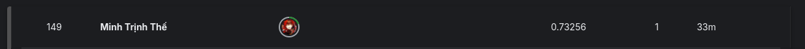

# How to Run

first you need to download the checkpoint at 
https://drive.google.com/file/d/17pjd2Ur4TtFqv50ipmOhvM_C3Vo4_dZu/view?usp=sharing

and then put that checkpoint folder ```checkpoint```

```sh
git clone git@github.com:trinhminh11/AssigmentDL.git
cd AssigmentDL
python infer.py --image_path {path_to_image}
or
python3 infer.py --image_path {path_to_image}
```

# Competition
https://www.kaggle.com/competitions/bkai-igh-neopolyp/leaderboard

<p align="center">
  
  
</p>
